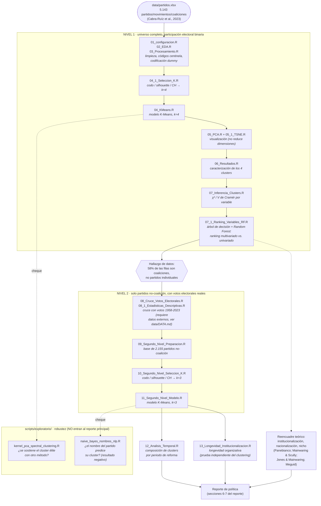

# Más allá de la ideología: tipologías empíricas de los partidos políticos colombianos (1848–2023)

Trabajo final del curso **Aprendizaje de Máquinas y Políticas Públicas**
(Bogotá Summer School in Economics 2026, Pontificia Universidad Javeriana).

**Autor:** Andrez Felipe Guerrero Torres

**Data:** Cabra-Ruíz, Torres, Wills-Otero & Castilla-Gutiérrez (2023), *Una
caracterización histórica de los partidos políticos de Colombia:
1958–2022* (Documento CEDE-Datos); Torres, Barinas-Forero, Forero-Mesa,
Sánchez & Tibavisco (2023), *Resultados electorales de Colombia*
(Documento CEDE-Datos). Centro de Estudios sobre Desarrollo Económico
(CEDE), Universidad de los Andes.

## Pregunta de investigación

¿Qué tipologías empíricas de partidos y movimientos políticos colombianos,
entre 1848 y 2023, emergen del análisis conjunto de sus características
organizativas, electorales e ideológicas?

Los perfiles se nombran e interpretan con un marco teórico que va más allá
de la ideología: **institucionalización** (Panebianco, 1988; Mainwaring &
Scully, 1995), medida como longevidad organizativa; **nacionalización**
electoral (Jones & Mainwaring, 2003), medida como alcance multinivel; y
**partidos de nicho** (Meguid, 2005), para organizaciones de representación
sectorial/identitaria.

Ver el reporte completo en [`reporte/Reporte_Final_Partidos_Politicos.docx`](reporte/Reporte_Final_Partidos_Politicos.docx)
(también disponible en [`reporte/Reporte_Final_Partidos_Politicos.md`](reporte/Reporte_Final_Partidos_Politicos.md)).
Todas las tablas de apoyo se presentan en una sección de **Anexos** al
final del documento, para no interrumpir el hilo argumentativo del cuerpo
del reporte.

## Resumen de hallazgos

- **Nivel 1** (K-Means, k=4, sobre las 5.143 organizaciones registradas,
  participación electoral binaria): solo el **1,8%** (93 partidos) está
  institucionalizado y nacionalizado (participa de forma consistente en
  varios niveles a la vez); el resto opera en un solo nivel o de forma
  marginal.
- **Nivel 2** (K-Means, k=3, sobre 2.155 partidos no-coalición, con votos
  reales 1958–2023): el **4,8%** ("partido institucionalizado", 103
  partidos, entre ellos el Liberal, el Conservador, Cambio Radical, Polo y
  Alianza Verde) concentra el grueso del respaldo electoral real,
  corroborando el hallazgo del nivel 1 con
  otra fuente de datos.
- **Descubrimiento de datos**: el 58% de las 5.143 filas de `partidos.xlsx`
  no son partidos individuales, sino coaliciones (`coalicion=1`), la mayoría
  de alcance municipal/departamental — aunque no todas son alianzas
  efímeras: el 71% está clasificado como "nacional" y muchas son alianzas
  puntuales Liberal-Conservador para una sola alcaldía.
- **Longevidad**: los partidos institucionalizados sobreviven en promedio
  13,3 años (mediana 8) frente a una mediana de 0 años en los partidos no
  institucionalizados y de nicho — confirmando con una variable
  independiente del clustering que la institucionalización, no la
  ideología, es el eje que mejor distingue a los partidos colombianos.
- **Evidencia temporal**: tras las reformas de 2003 y 2011 (pensadas para
  frenar la proliferación de partidos), el número de organizaciones nuevas
  se disparó y la probabilidad de que un partido nuevo llegue a estar
  institucionalizado y nacionalizado cayó de 14,4% a 1,2%.

## Estructura del repositorio

```
├── data/                    partidos.xlsx + DATA.md (fuentes y datos no incluidos)
├── scripts/                 pipeline de R, en orden de ejecucion (01 a 13)
│   └── exploratorio/        chequeos que NO entraron al reporte final
├── resultados/              outputs curados (solo lo que se usa en el reporte)
├── figuras/                 graficos (PNG) usados en el reporte
└── reporte/                 reporte final (.docx y .md), con las tablas en Anexos
```

## Flujo de la metodología empírica

Cada nodo indica el o los scripts (`scripts/`) que lo producen, para que el
diagrama funcione también como mapa de navegación del repositorio.



Este diagrama resume la *dirección* de la metodología empírica: no fue un
plan lineal decidido de antemano, sino una secuencia en la que cada
hallazgo (el bug de codificación, el descubrimiento de las coaliciones, la
debilidad de la ideología como marcador) reorientó el siguiente paso. Los
scripts `01`–`07` y `07_1` corresponden al nivel 1 (universo completo); a
partir de `08` todo el pipeline trabaja sobre el nivel 2 (solo partidos
no-coalición, con votos reales); `12` y `13` son las dos pruebas de
validación independientes del clustering (temporal y longevidad,
respectivamente); y `scripts/exploratorio/` son chequeos de robustez que
no entraron al reporte final (ver sección "Cómo correr el pipeline").

## Cómo se construyó este análisis

El trabajo avanzó en capas, cada una motivada por lo que reveló la anterior:

1. **Pipeline base** (scripts 01–07): limpieza, codificación dummy, K-Means
   (k=4) sobre participación electoral binaria, y validación estadística
   (χ²/V de Cramér). Al auditar este pipeline se encontraron y corrigieron
   dos errores reales — una codificación dummy asimétrica que duplicaba el
   peso de una variable, e imputación por moda de códigos centinela que
   fabricaba señal falsa (detalle en la sección 7 del reporte). El script
   `07_1_Ranking_Variables_RF.R` complementa la V de Cramér (univariada)
   con un árbol de decisión y un Random Forest (multivariados) para ver si
   el ranking de variables se sostiene al controlar por su correlación
   mutua — se sostiene en general, con una excepción reveladora (sección
   5.3 del reporte).
2. **Segundo nivel con votos reales** (scripts 08–11): al cruzar la base con
   resultados electorales 1958–2023 se descubrió que el 58% de las filas
   son coaliciones, no partidos — un hallazgo de datos que reencuadra todo
   el análisis. El segundo modelo (k=3, solo partidos no-coalición, con
   votos reales) corrobora el hallazgo del primero con otra fuente.
3. **Reencuadre teórico** (motivación del reporte, script 13): la ideología
   resultó ser un marcador débil; se adoptó institucionalización
   (longevidad), nacionalización (alcance multinivel) y nicho como ejes más
   robustos, validados con el propio diccionario de la base (que ya usa
   longevidad como una de sus cinco dimensiones oficiales).
4. **Evidencia temporal** (script 12): comparar clusters por periodo de
   reforma (1991, 2003, 2011) mostró que la proliferación de partidos no
   institucionalizados no bajó tras las reformas — se aceleró.
5. **Chequeos de robustez** (`scripts/exploratorio/`): Kernel PCA/Spectral
   Clustering y un Naive Bayes sobre el texto del nombre, documentados
   aunque no entraron al reporte principal (el segundo, un resultado
   negativo honesto).

## Cómo correr el pipeline

Requiere R (>= 4.x) con los paquetes: `tidyverse`, `readxl`, `janitor`,
`skimr`, `caret`, `cluster`, `factoextra`, `corrplot`, `fpc`, `DescTools`,
`broom`, `scales`, `reshape2`, `ggalluvial`, `data.table`, `haven`,
`stringi`, `kernlab`, `mclust`, `tidytext`, `e1071`, `Rtsne`, `rpart`,
`randomForest`.

`01_configuracion.R`, `02_EDA.R` y `03_Procesamiento.R` conservan el estilo
del análisis original: son un único script largo dividido en tres archivos
por legibilidad, y comparten el objeto `partidos` en memoria. Deben
ejecutarse con `source()` en una sola sesión de R, en ese orden (o
pegarse en la consola); `03_Procesamiento.R` guarda `datos_ml.rds` al
final, que es lo único que necesitan los scripts `04` en adelante. Desde
`04_1_Seleccion_K.R` en adelante cada script es independiente: vuelve a
cargar sus insumos desde disco, así que puede correrse por separado con
`Rscript`.

Todos los modelos usan la semilla **20260706** (`set.seed(20260706)`). Con
K-Means y `nstart=100` la partición converge a la misma solución
sustantiva sin importar la semilla exacta; lo único que puede cambiar es
qué número de cluster (1, 2, 3...) le toca a cada grupo, por lo que los
scripts de nivel 2 (`11_Segundo_Nivel_Modelo.R`) asignan las etiquetas por
**tamaño del cluster**, no por su ID arbitrario.

Ejecutar desde la raíz del repositorio, en orden:

| Script | Qué hace |
|---|---|
| `01_configuracion.R` | Carga paquetes e importa `data/partidos.xlsx` |
| `02_EDA.R` | Análisis exploratorio (missing, distribuciones) |
| `03_Procesamiento.R` | Limpieza, codificación dummy, estandarización |
| `04_1_Seleccion_K.R` | Selección de k (codo, silhouette, Calinski-Harabasz) |
| `04_KMeans.R` | Modelo K-Means final (nivel 1, k=4) |
| `05_PCA.R` | Componentes principales (visualización) |
| `05_1_TSNE.R` | Proyección t-SNE no lineal (complementa la PCA; UMAP falló por perfiles categóricos duplicados) |
| `06_Resultados.R` | Caracterización de los 4 clusters |
| `07_Inferencia_Clusters.R` | χ², V de Cramér por variable |
| `07_1_Ranking_Variables_RF.R` | Ranking multivariado de variables (árbol de decisión y Random Forest) vs. V de Cramér (sección 5.3) |
| `08_Cruce_Votos_Electorales.R` | Cruce con votos reales 1958–2023 (requiere datos no incluidos, ver `data/DATA.md`) |
| `08_1_Estadisticas_Descriptivas.R` | Tablas descriptivas de partidos.xlsx y de los votos históricos (secciones 4.3 y 5.4) |
| `09_Segundo_Nivel_Preparacion.R` | Prepara datos del segundo nivel (partidos no-coalición + votos) |
| `10_Segundo_Nivel_Seleccion_K.R` | Selección de k para el segundo nivel |
| `11_Segundo_Nivel_Modelo.R` | Modelo final del segundo nivel (k=3) |
| `12_Analisis_Temporal.R` | Composición de clusters por periodo de reforma |
| `13_Longevidad_Institucionalizacion.R` | Longevidad organizativa por cluster (prueba independiente de institucionalización) |

`scripts/exploratorio/` contiene dos chequeos adicionales que **no** están en
el reporte final: Kernel PCA / Spectral Clustering (robustez del nivel 1) y
un Naive Bayes que intenta predecir el nivel electoral a partir del texto
del nombre del partido (resultado negativo: el nombre no predice el éxito
electoral de forma confiable).

Los scripts `01`–`07` guardan sus resultados en la raíz del proyecto (tal
como en el análisis original); los scripts `08` en adelante —incluido
`07_1_Ranking_Variables_RF.R`, añadido después de curar `resultados/`—
guardan directamente en `resultados/`.

**`resultados/` está curado, no es un volcado completo**: se excluyeron
exports crudos a nivel de fila (`coordenadas_pca.csv`,
`datos_clusterizados.csv`, ~3 archivos, redundantes con las figuras) y 48
tablas intermedias por-variable de `07_Inferencia_Clusters.R`
(`Frecuencia_*`, `Porcentaje_*`, `Tabla_*`, `Residuos_*`) que no se citan en
el reporte — solo se conserva su resumen (`InferenciaClusters.csv`). Todos
son 100% reproducibles corriendo los scripts; simplemente no aportaban a
entender los hallazgos, así que no se versionan (ver `.gitignore`).

Los datos electorales para reproducir los scripts 08–13 se descargan de:
[DataHub Uniandes — Resultados electorales de Colombia](https://datahub.uniandes.edu.co/dataset.xhtml?persistentId=doi%3A10.71590%2FR2KLKI)
(ver `data/DATA.md` para instrucciones completas).

### Nota sobre rutas con tildes

Ver `data/DATA.md` — si el repositorio queda dentro de una ruta con
caracteres acentuados (p. ej. iCloud Drive), `readxl`/`haven` pueden fallar
al leer `.xlsx`/`.dta`. Solución: copiar `data/` a una ruta sin tildes o
clonar el repositorio fuera de esa carpeta.

## Correcciones metodológicas documentadas

Durante la elaboración de este trabajo se detectaron y corrigieron dos
errores en el pipeline original (ver sección 7 del reporte):

1. Codificación dummy asimétrica (`model.matrix(~.-1, ...)` duplicaba el
   peso de la primera variable categórica).
2. Imputación por moda de códigos centinela 98/99 en variables con hasta
   99% de "no aplica/sin clasificar", que fabricaba una variable casi
   constante y distorsionaba el clustering.

## Autor

Curso de Aprendizaje de Máquinas y Políticas Públicas, Bogotá Summer School
in Economics 2026, Pontificia Universidad Javeriana.

## Reconocimientos

Este repositorio y el reporte que documenta se desarrollaron con el apoyo
de **Claude (Claude Code, Anthropic)** como asistente de análisis: revisión
y depuración del pipeline de R, ejecución de los modelos, redacción y
edición del reporte, y organización de esta documentación. Cada decisión
metodológica —de la elección de k a la corrección de los errores de la
sección 7— fue evaluada y validada por el autor.
