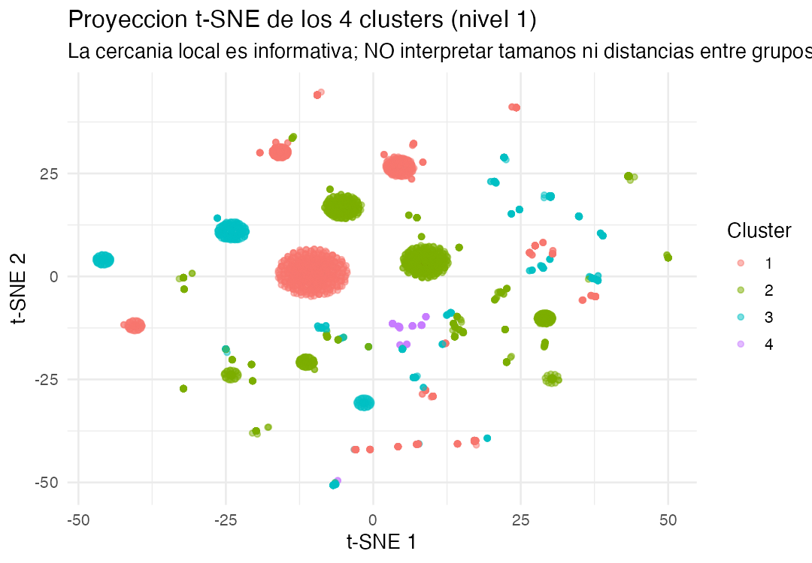

# ¿Maquinarias electorales o vehículos de garaje?

### Perfiles de los partidos y movimientos políticos colombianos (1848–2022): una tipología basada en K-Means

**Aprendizaje de Máquinas y Políticas Públicas**
Bogotá Summer School in Economics 2026 — Pontificia Universidad Javeriana
Reporte de política · 6 de julio de 2026
**Autor: Andrez Felipe Guerrero Torres**
Base de datos: CEDE – Universidad de los Andes, clasificación de partidos políticos colombianos

---

## Resumen de los datos y su preparación

Este reporte combina dos fuentes de datos. La primera es la clasificación de partidos y movimientos políticos colombianos del CEDE (Universidad de los Andes): 5.143 organizaciones registradas entre 1848 y 2022, con variables de ideología, carácter tradicional, grado de nacionalización, grupo representativo y participación binaria (0/1) en siete tipos de elección (alcaldía, asamblea, cámara, concejo, gobernación, presidencia y senado). Al revisar esta base se descubrió que el 58% de las filas (2.988) no son partidos propiamente dichos, sino coaliciones ad hoc de alcance municipal o departamental (p. ej. "COALICION CONCEJO DE X. PARTIDO Y Y PARTIDO Z"), un hecho que se usó para depurar los análisis posteriores.

La segunda fuente son los resultados electorales históricos de la Registraduría/CEDE para 1958–2023 (~130 archivos, 2,5 GB), a nivel de candidato-municipio-elección, para los mismos siete tipos de elección. Estos se cruzaron por nombre con la primera base (tras excluir las coaliciones y normalizar texto —mayúsculas, sin tildes ni puntuación, sin palabras genéricas como "PARTIDO" o "MOVIMIENTO"—) logrando emparejar el 80,6% de los votos históricos no-coalición.

La preparación de los datos incluyó, entre otros pasos: limpieza de nombres de variables; imputación cuidadosa de valores faltantes evitando fabricar señal falsa en variables con códigos centinela 98/99 (11%–99% de los casos según la variable); codificación dummy consistente de las variables categóricas (corrigiendo un error de codificación asimétrica detectado durante la revisión, ver sección 7); estandarización (z-score) de todas las variables antes del clustering; y, para el análisis con votos, una transformación logarítmica log(1+votos) dado su fuerte sesgo a la derecha. El detalle completo de cada paso se documenta en las secciones 4 y 5.

Con estos insumos se construyeron dos niveles de análisis: (1) un modelo de K-Means sobre el universo completo de 5.143 organizaciones usando participación binaria (secciones 4–6), y (2) un segundo modelo, restringido a los 2.155 partidos no-coalición y enriquecido con los votos reales por nivel electoral (sección 5.4), que sirve como validación cruzada del primero con otra fuente de datos.

---

## 1. Pregunta de investigación

¿Qué perfiles o tipos de partidos y movimientos políticos han existido en Colombia entre 1848 y 2022, en términos de su alcance electoral (local, regional o nacional) y su carácter ideológico, y qué proporción de esas organizaciones corresponde a vehículos electorales marginales frente a maquinarias partidistas consolidadas y multinivel?

Es una pregunta de naturaleza descriptiva/exploratoria: no se busca predecir una etiqueta ya conocida, sino descubrir agrupamientos latentes a partir de los atributos disponibles (ideología, tradición, grado de nacionalización, grupo representativo y participación electoral en siete tipos de cargos de elección popular). El protocolo del curso admite explícitamente preguntas de este tipo ("¿qué grupos o patrones existen?"), y la ausencia de una variable de resultado observada hace que el aprendizaje no supervisado sea la estrategia natural.

## 2. Motivación

La forma más habitual de describir a un partido colombiano es por su etiqueta ideológica (izquierda, derecha, centro). Pero los propios datos de este reporte muestran que esa etiqueta es un marcador débil e inconsistente: cerca del 40% de los partidos históricos no tiene ideología clasificable, y —de forma casi paradójica (sección 5.4)— los partidos electoralmente más exitosos son también los que con mayor frecuencia carecen de clasificación ideológica. Ideología, entonces, no es el eje más útil para tipificar a un partido colombiano.

La literatura sobre sistemas de partidos ofrece dimensiones teóricas más robustas y, sobre todo, más observables en los datos disponibles. Panebianco (1988) y Mainwaring y Scully (1995) definen la institucionalización partidista como la capacidad de una organización de sobrevivir y reproducirse en el tiempo más allá de sus fundadores, en oposición a partidos personalistas construidos alrededor de un líder o una elección puntual; empíricamente, esa capacidad se aproxima con la longevidad organizativa. Jones y Mainwaring (2003) proponen la nacionalización electoral —la competencia sostenida de un partido en múltiples niveles y territorios, no solo en uno— como el complemento natural de la institucionalización. Y Meguid (2005) caracteriza a los partidos de nicho como aquellos que compiten sobre una dimensión estrecha y no económica (étnica, religiosa, sectorial) en vez de la disputa ideológica izquierda-derecha convencional. Estas tres nociones —institucionalización (longevidad), nacionalización (alcance multinivel) y nicho— son las que se usan en este reporte para nombrar e interpretar los perfiles encontrados, en lugar de depender de la clasificación ideológica registrada en la base. Esta elección no es solo una lectura externa: los propios autores de la base de datos (Cabra-Ruíz, Torres, Wills-Otero & Castilla-Gutiérrez, 2023) clasifican a los partidos colombianos en cinco dimensiones —ideología, grupos identitarios representados, tradicionalidad, grado de nacionalización y longevidad—, es decir, la longevidad organizativa ya es, por diseño, una de las dimensiones centrales de esta base, no un añadido de este reporte.

Esta relectura no es solo académica: el debate sobre la proliferación de partidos y movimientos políticos —popularmente conocidos como "partidos de garaje" o "microempresas electorales"— ha sido central en las reformas al régimen de partidos en Colombia (Acto Legislativo 01 de 2003, Ley 1475 de 2011 y las discusiones de reforma política de 2023–2025). La preocupación de fondo es que un número elevado de organizaciones obtienen o mantienen personería jurídica sin construir una presencia electoral real ni una organización duradera, lo que fragmenta la representación, dificulta la rendición de cuentas y encarece la administración electoral (tarjetones, financiación estatal, curules). Si la ideología no distingue bien a estos partidos, la institucionalización y la nacionalización sí podrían hacerlo, y de forma más directamente accionable para el diseño de reglas (umbrales, financiación).

A la vez, la literatura sobre sistemas de partidos en Colombia (Pizarro León-Gómez, Gutiérrez Sánchez, entre otros) documenta una fragmentación creciente desde el colapso del bipartidismo tradicional en los años 2000, con partidos cada vez más personalistas y menos institucionalizados. Sin embargo, buena parte de ese diagnóstico se apoya en estudios de caso o en el análisis de las principales colectividades, sin cuantificar sistemáticamente, sobre el universo completo de partidos alguna vez registrados, cuántos son organizaciones institucionalizadas y nacionalizadas y cuántos son vehículos electorales efímeros.

Este reporte busca llenar ese vacío: usando técnicas de agrupamiento no supervisado sobre la base histórica más completa disponible (CEDE–Uniandes, 5.143 partidos y movimientos entre 1848 y 2022), se construye una tipología empírica —anclada en institucionalización, nacionalización y nicho— que permite cuantificar cuántas organizaciones corresponden a cada perfil. El hallazgo central —que menos del 2% de las organizaciones históricas está institucionalizado y nacionalizado, mientras el resto opera de forma efímera o local— aporta evidencia directa y cuantificada al diseño de umbrales de personería jurídica, reglas de coalición y fórmulas de financiación estatal por desempeño electoral.

## 3. Estrategia empírica

Dado que la pregunta es descriptiva y no existe en los datos una variable de "tipo de partido" previamente etiquetada, se descartó cualquier método supervisado (regresión logística, árboles, kNN, SVM) porque estos requieren una variable objetivo observada; aquí la tipología es precisamente lo que se busca descubrir. Se optó por K-Means, un método de aprendizaje no supervisado, por tres razones:

- **Escala**: con 5.143 observaciones, el clustering jerárquico (que requiere una matriz de distancias de n×n y no escala bien más allá de unos pocos miles de casos, además de ser difícil de visualizar en un dendrograma con tantas hojas) resulta poco práctico frente a K-Means, cuyo costo computacional crece linealmente con n.
- **Naturaleza de los datos**: tras la codificación dummy de las variables categóricas y su estandarización, K-Means con distancia euclidiana es un método simple, interpretable y computacionalmente eficiente, adecuado como primera aproximación exploratoria.
- **Validez interna verificable**: a diferencia de métodos como DBSCAN (sensible a la densidad y a la elección de ε, poco adecuado para datos dummy de alta dimensionalidad y dispersos) o los modelos de mezcla gaussiana (que asumen una estructura de covarianza continua poco natural para variables binarias), K-Means admite criterios de validación estándar y ampliamente aceptados (método del codo, índice de silhouette, Calinski-Harabasz) que permiten justificar objetivamente el número de grupos.

El análisis de componentes principales (PCA) se empleó únicamente como herramienta complementaria de visualización e interpretación de las cargas de las variables, no como paso previo de reducción de dimensionalidad para el clustering (K-Means se corrió sobre las 25–30 variables dummy estandarizadas, no sobre los componentes).

Una vez obtenidos los grupos, se validó su significancia estadística mediante pruebas χ² de independencia entre cada variable original y la asignación de cluster, con el estadístico V de Cramér como medida de tamaño del efecto y corrección de Benjamini-Hochberg para el múltiple testing (12 pruebas simultáneas).

## 4. Datos

La base —"Una caracterización histórica de los partidos políticos de Colombia: 1958–2022" (Cabra-Ruíz, Torres, Wills-Otero & Castilla-Gutiérrez, 2023, Documento CEDE-Datos, Universidad de los Andes)— clasifica todos los partidos, movimientos y coaliciones que compitieron en elecciones de concejo, alcaldía, asamblea, gobernación, cámara, senado y presidencia con registro entre 1958 y 2022. La unidad de observación es el partido/movimiento/coalición (identificado por un código que combina el año de fundación y un consecutivo); el campo temporalidad, que marca su primera y última aparición en registros oficiales, se remonta hasta 1848 para las organizaciones más antiguas (p. ej. el Partido Liberal). El archivo original contiene 5.143 observaciones y 27 variables (25 documentadas en el diccionario oficial, más 2 adicionales de participación en primera y segunda vuelta presidencial).

### 4.1 Variables utilizadas

| Variable | Descripción | Tipo |
|---|---|---|
| tradicional | Indicador de partido tradicional (Liberal/Conservador y afines históricos) | Binaria |
| gradonac | Grado de nacionalización del partido (0/1; 99 = sin clasificar) | Categórica |
| ideologia | 1 = Izquierda; 2 = Derecha; 3 = Ni derecha ni izquierda; 4 = Información insuficiente para clasificar | Categórica |
| grupo_representativo_1/2 | Grupo identitario representado (afrocolombianos, indígenas, católicos/cristianos, ex-militantes, campesinos, mujeres, víctimas del conflicto); 98 = no representa un grupo identitario; 99 = no se tiene información | Categórica |
| part_alcaldia ... part_senado | Participación (0/1) en elecciones de alcaldía, asamblea, cámara, concejo, gobernación, presidencia (1ª y 2ª vuelta) y senado | Binarias (9 variables) |

### 4.2 Calidad y tratamiento de los datos

El análisis exploratorio inicial mostró que las variables de texto libre (justificaciones y fuentes de clasificación) tienen alta proporción de valores faltantes genuinos (entre 73% y 100%), lo cual es esperable porque solo se documentan cuando existe una fuente primaria disponible; estas variables no se usaron en el modelo.

Más relevante para la metodología: según el diccionario oficial de la base (Cabra-Ruíz, Torres, Wills-Otero & Castilla-Gutiérrez, 2023), gradonac usa 99 para "no se puede clasificar", y grupo_representativo_1/2 usan dos códigos con significados distintos: 98 ("el partido no representa un grupo identitario" —una respuesta sustantiva válida, no un dato faltante—) y 99 ("no se tiene información" —faltante genuino—). Estos códigos cubren, respectivamente, el 11,3% (gradonac=99), el 88,6% (grupo_representativo_1: 98+99) y el 98,6% (grupo_representativo_2: 98+99) de los partidos. En una primera versión del pipeline estos códigos se recodificaban a NA (sin distinguir 98 de 99) y se imputaban con la moda de las categorías válidas restantes; se detectó durante la revisión de este trabajo que ese procedimiento fabricaba una variable casi constante (hasta 89% de los partidos forzados a una sola categoría) que, tras estandarizar, dominaba artificialmente la distancia euclídea de K-Means. Se corrigió tratando 98 y 99 como categorías propias y distintas entre sí, preservando tanto la información real de que la mayoría de partidos no representa un grupo identitario (98) como la de que en muchos casos simplemente no hay información disponible (99), sin fabricar una moda ficticia.

Todas las variables categóricas se transformaron a variables dummy mediante una matriz de diseño con intercepto que luego se descarta (evitando así que la primera variable del conjunto reciba, por un efecto conocido de R, una codificación de rango completo mientras las demás reciben codificación de referencia —otro problema detectado y corregido en este trabajo, ver sección 7). Las columnas resultantes con varianza cero se eliminaron y el conjunto final (25–30 variables dummy, según la especificación) se estandarizó (media 0, desviación 1).

### 4.3 Estadísticas descriptivas

Distribución de las variables categóricas usadas en el modelo, sobre el universo completo (n=5.143):

| Variable | Categoría | n | % |
|---|---|---|---|
| tradicional | 0 — No tradicional | 4,838 | 94.1% |
| tradicional | 1 — Tradicional | 305 | 5.9% |
| gradonac | 0 — No nacional | 2,428 | 47.2% |
| gradonac | 1 — Nacional | 2,134 | 41.5% |
| gradonac | 99 — No se puede clasificar | 581 | 11.3% |
| ideologia | 1 — Izquierda | 414 | 8.0% |
| ideologia | 2 — Derecha | 414 | 8.0% |
| ideologia | 3 — Ni derecha ni izquierda | 2,237 | 43.5% |
| ideologia | 4 — Información insuficiente | 2,078 | 40.4% |
| grupo_representativo_1 | 1–7 (afro, indígena, cristiano, ex-militante, campesino, mujer, víctima) | 587 | 11.4% |
| grupo_representativo_1 | 98 — No representa grupo identitario | 979 | 19.0% |
| grupo_representativo_1 | 99 — No se tiene información | 3,577 | 69.6% |
| grupo_representativo_2 | 1–6 (mismas categorías, sin víctimas) | 72 | 1.4% |
| grupo_representativo_2 | 98 — No representa grupo identitario | 3,056 | 59.4% |
| grupo_representativo_2 | 99 — No se tiene información | 2,015 | 39.2% |

Participación electoral por nivel, sobre el universo completo (n=5.143; cada partido puede participar en más de un nivel):

| Nivel | n participa | % participa |
|---|---|---|
| Alcaldía | 2,844 | 55.3% |
| Concejo | 1,364 | 26.5% |
| Cámara | 773 | 15.0% |
| Asamblea | 444 | 8.6% |
| Gobernación | 274 | 5.3% |
| Senado | 227 | 4.4% |
| Presidencia | 63 | 1.2% |

La participación cae drásticamente a medida que sube el nivel de gobierno —de 55,3% en alcaldías a apenas 1,2% en presidencia—, un primer indicio, ya visible antes del clustering, de que la gran mayoría de los partidos colombianos opera exclusivamente en el ámbito local.

## 5. Implementación de la metodología

### 5.1 Selección del número de clusters

Se calcularon tres criterios para k entre 2 y 10, usando 100 inicializaciones aleatorias (nstart = 100) por valor de k:

| k | WSS (suma de cuadrados intra-cluster) | Silhouette promedio | Calinski-Harabasz |
|---|---|---|---|
| 2 | 130,984 | 0.280 | 914 |
| 3 | 122,472 | 0.248 | 667 |
| 4 | 115,875 | 0.294 | 567 |
| 5 | 108,959 | 0.301 | 534 |
| 6 | 102,334 | 0.305 | 521 |
| 7 | 99,223 | 0.290 | 475 |
| 8 | 92,186 | 0.341 | 494 |
| 9 | 87,778 | 0.351 | 486 |
| 10 | 82,840 | 0.359 | 492 |

El criterio Calinski-Harabasz favorece fuertemente k=2 (914), mientras el índice de silhouette crece de forma casi monótona hacia valores mayores de k (máximo en el rango explorado en k=10, con 0.359). Ante este desacuerdo entre criterios —habitual en datos categóricos dummy de alta dimensionalidad— se optó por k=4, que ofrece un equilibrio razonable: un incremento moderado de silhouette respecto a k=2–3 (0.294 vs. 0.248–0.280) y, sobre todo, una partición sustantivamente interpretable y útil para el reporte de política (sección 6), frente a soluciones de k más alto que, si bien maximizan la cohesión estadística, son más difíciles de comunicar con claridad a un tomador de decisiones.

*Figura 1. Índice de silhouette por número de clusters (línea punteada: k=4, valor elegido).*

### 5.2 Modelo final y validación

El modelo final (k=4, nstart=100, iter.max=1000, semilla=2025) explica el 25,2% de la varianza total (between_SS/total_SS) y alcanza un silhouette promedio de 0,26. La cohesión interna varía considerablemente entre grupos: los clusters 1 y 2 (los más grandes) muestran silhouette promedio de 0,42 y 0,21 respectivamente —buena separación—, mientras que los clusters 3 y 4 muestran valores de 0,12 y –0,04, respectivamente, indicando que estos últimos, en particular el cluster 4 (el más pequeño y sustantivamente más interesante), tienen menor cohesión interna y deben interpretarse con cautela (ver limitaciones).

| Cluster | n | % del total | Silhouette promedio |
|---|---|---|---|
| 1 | 1,931 | 37.6% | 0.42 |
| 2 | 2,024 | 39.4% | 0.21 |
| 3 | 1,095 | 21.3% | 0.12 |
| 4 | 93 | 1.8% | −0.04 |

*Figura 2. Clusters proyectados sobre las dos primeras componentes principales del PCA (uso exclusivamente ilustrativo; el clustering se estimó sobre las variables originales, no sobre los componentes).*

Como complemento, se proyectaron los mismos datos con t-SNE, una técnica no lineal que preserva la vecindad local mejor que una proyección lineal como PCA (cubierta en la sesión de aprendizaje no supervisado del curso). A diferencia de UMAP, que falló en inicializarse por la enorme cantidad de perfiles categóricos idénticos o casi idénticos entre partidos, t-SNE sí produjo una proyección estable.

*Figura 3. Proyección t-SNE de los 4 clusters (nivel 1). Cada mancha compacta refleja un perfil categórico exacto compartido por muchos partidos; la cercanía local es informativa, pero —siguiendo la guía del curso— el tamaño y la distancia entre manchas no debe interpretarse literalmente.*

La proyección revela una estructura más fina de la que sugiere el PCA lineal: los datos forman decenas de manchas compactas y bien separadas (cada una, un perfil categórico exacto repetido por muchos partidos), y los 4 clusters de K-Means no siempre coinciden con esas manchas de forma perfecta —el cluster 1 agrupa varias manchas distintas bajo una misma etiqueta—, mientras que el cluster 4 ("maquinarias electorales multinivel", el más pequeño) aparece como su propio grupo compacto y separado, lo que respalda su interpretación como un perfil sustantivamente distinto y no como un artefacto del algoritmo.

### 5.3 Validación estadística de los perfiles

Para cada una de las 12 variables originales se realizó una prueba χ² de independencia frente a la asignación de cluster, reportando la V de Cramér (tamaño del efecto) y el valor p ajustado por múltiples comparaciones (Benjamini-Hochberg). Las 12 variables resultaron significativas tras el ajuste (p < 0.001), lo que confirma que la partición de K-Means captura patrones reales y no ruido; las variables con mayor asociación son:

| Variable | V de Cramér | χ² | p ajustado (BH) |
|---|---|---|---|
| part_presidencia | 0.821 | 3,463.4 | < 0.001 |
| ideologia | 0.615 | 5,835.6 | < 0.001 |
| grupo_representativo_2 | 0.573 | 5,058.6 | < 0.001 |
| grupo_representativo_1 | 0.571 | 5,038.6 | < 0.001 |
| gradonac | 0.542 | 3,017.0 | < 0.001 |
| part_senado | 0.326 | 547.4 | < 0.001 |
| tradicional | 0.305 | 479.6 | < 0.001 |

Es relevante notar que, tras corregir el error de codificación dummy descrito en la sección 7, la variable tradicional —que en la versión inicial (con el error) mostraba una V de Cramér perfecta de 1,0, sugiriendo que definía un cluster completo por sí sola— pasó a tener una asociación moderada (0,305), consistente con su verdadero peso relativo entre las 12 variables. Esto confirma que la señal original estaba inflada por el artefacto de codificación.

### 5.4 Segundo nivel de análisis: validación con votos electorales reales (1958–2023)

Los indicadores part_* usados hasta ahora son binarios (participó o no participó), sin capturar la magnitud del respaldo electoral. Para profundizar, se incorporaron los resultados electorales históricos de la Registraduría/CEDE (1958–2023) para alcaldía, asamblea, cámara, concejo, gobernación, presidencia (ambas vueltas) y senado, a nivel de candidato-municipio-elección.

Al cruzar estos resultados con partidos.xlsx por nombre se descubrió un hecho relevante para caracterizar la base completa: el 58% de las 5.143 organizaciones registradas (2.988 filas) corresponden a coaliciones (variable coalicion=1 del diccionario oficial), la mayoría de alcance municipal o departamental (por ejemplo, "COALICION CONCEJO DE X.PARTIDO Y Y PARTIDO Z"), no a partidos propiamente dichos. Es importante matizar esta cifra: no todas son alianzas efímeras entre movimientos desconocidos —el 71% de las coaliciones está clasificado como gradonac=1 ("nacional"), y muchas corresponden a alianzas puntuales entre el Partido Liberal y el Partido Conservador para una sola alcaldía, no a vehículos de partidos marginales—. Aun así, el hallazgo refuerza, desde otro ángulo, el diagnóstico de la sección 6: buena parte del universo de "partidos" colombianos son en realidad alianzas de un solo uso, con o sin partidos tradicionales de por medio.

Dado que no es posible atribuir de forma no arbitraria los votos de una coalición a un partido individual, estas filas se excluyeron del ejercicio de votos, dejando un universo de 2.155 partidos no-coalición. El emparejamiento de nombres (partido en el archivo electoral vs. partidos.xlsx) usó normalización ligera —mayúsculas, sin tildes, sin puntuación, y eliminando palabras genéricas como "PARTIDO", "MOVIMIENTO", "COLOMBIANO", "POLÍTICO", "NACIONAL"— logrando emparejar el 80,6% de los votos históricos no-coalición (1.636 de 2.119 partidos no-coalición con al menos un registro de votos). El 19,4% restante corresponde sobre todo a variantes con eslóganes propios (p. ej. "PARTIDO CENTRO DEMOCRATICO - MANO FIRME CORAZON GRANDE") que una normalización ligera no puede resolver sin riesgo de falsos positivos.

Estadística descriptiva de los votos históricos (1958–2023) emparejados, por nivel electoral:

| Nivel | Partidos con votos | Votos totales | Promedio | Mediana | Máximo |
|---|---|---|---|---|---|
| Concejo | 618 | 141,520,199 | 228,997 | 2,678 | 50,204,571 |
| Asamblea | 141 | 139,802,861 | 991,510 | 59,738 | 61,833,083 |
| Cámara | 460 | 109,568,676 | 238,193 | 4,620 | 47,622,263 |
| Senado | 171 | 102,928,017 | 601,918 | 37,287 | 43,675,547 |
| Alcaldía | 808 | 99,644,219 | 123,322 | 3,249 | 27,318,479 |
| Presidencia | 64 | 93,826,350 | 1,466,037 | 29,177 | 41,705,550 |
| Gobernación | 145 | 59,680,036 | 411,586 | 90,477 | 22,171,005 |

La enorme brecha entre el promedio y la mediana en todos los niveles (p. ej. en cámara, promedio de 238.193 votos frente a una mediana de apenas 4.620) confirma el fuerte sesgo a la derecha que motivó la transformación log(1+votos): unos pocos partidos concentran la mayoría de los votos históricos, mientras la mayoría de los partidos con algún registro apenas reciben unos cuantos miles de votos en toda su historia.

Para cada uno de los 2.155 partidos no-coalición se sumaron los votos históricos por nivel electoral (transformados con log(1+votos) por su fuerte sesgo a la derecha) y se combinaron, con la misma codificación dummy consistente de la sección 4.2, con las variables categóricas originales (ideología, tradicional, gradonac, grupo representativo). El criterio de selección de k favoreció con claridad valores bajos (silhouette = 0,542 en k=2 y 0,528 en k=3, frente a 0,27–0,48 para k≥4); se eligió k=3 en vez de k=2 porque separa un tercer grupo —una élite partidista minoritaria— que k=2 fusiona con el grupo intermedio, y esa distinción es la más relevante para el reporte de política.

Nótese que el modelo no se estimó solo con votos de senado: las siete variables de votos (log-transformadas, una por nivel electoral) entraron todas como insumo del K-Means, junto con las variables categóricas.

| Cluster | n | % | Ideología no clasif. | Ejemplos |
|---|---|---|---|---|
| Partido vehículo | 1,854 | 86.0% | 99.8% | microempresas electorales sin trayectoria |
| Partido de nicho | 198 | 9.2% | 0.0% | ONIC, movimientos cristianos, integración popular |
| Partido institucionalizado | 103 | 4.8% | 48.5% | Liberal, Conservador, Cambio Radical, Polo, Verde |

Votos históricos promedio por partido y nivel electoral (1958–2023), por cluster:

| Cluster | Alcaldía | Asamblea | Cámara | Concejo | Gobernación | Presidencia | Senado |
|---|---|---|---|---|---|---|---|
| Partido vehículo | 6,686 | 1,024 | 2,026 | 2,782 | 3,529 | 1,650 | 1,431 |
| Partido de nicho | 16,399 | 1,905 | 2,370 | 4,126 | 17,845 | 67,019 | 782 |
| Partido institucionalizado | 805,796 | 1,329,062 | 1,020,909 | 1,290,609 | 471,643 | 752,177 | 971,416 |

El patrón se sostiene en los siete niveles: el cluster "Partido institucionalizado" supera al "Partido vehículo" por un factor de 60 a 1.300 veces según el nivel, y no es simplemente un resultado impulsado por una sola elección (por ejemplo, solo presidencia o solo senado). El cluster "Partido de nicho" se distingue por una presencia relativamente alta en gobernación y presidencia frente a una votación mínima en senado, coherente con partidos de representación de intereses específicos que rara vez compiten a nivel nacional.

*Figura 4. Segundo nivel: clusters de partidos no-coalición usando votos electorales reales (1958-2023), proyectados sobre las dos primeras componentes principales.*

El cluster "Partido institucionalizado" (4,8% de los partidos no-coalición) incluye, de forma reconocible, al Partido Liberal Colombiano (43,6 millones de votos históricos acumulados al Senado), Partido Conservador Colombiano (30,5 millones), Cambio Radical, Polo Democrático Alternativo, Alianza Verde, Nuevo Liberalismo y Opción Ciudadana, entre otros. Este resultado, obtenido con la magnitud real del respaldo electoral y restringido a partidos genuinos (sin las coaliciones ad hoc), corrobora con otra fuente de datos el hallazgo central de la sección 6: una fracción muy pequeña de las organizaciones políticas colombianas concentra la enorme mayoría del músculo electoral real del país.

### 5.5 Longevidad organizativa: la institucionalización puesta a prueba

Si la institucionalización se define, siguiendo a Panebianco (1988) y Mainwaring y Scully (1995), como la capacidad de una organización de sobrevivir en el tiempo más allá de su fundación, entonces la longevidad de cada partido (calculada a partir del campo temporalidad, como años entre su fundación y su último registro) ofrece una prueba directa —independiente del ejercicio de clustering— de si los nombres asignados a los tres perfiles del segundo nivel son sustantivamente adecuados.

| Cluster | n | Longevidad promedio (años) | Longevidad mediana (años) | Longevidad máxima (años) |
|---|---|---|---|---|
| Partido vehículo | 1,854 | 0.5 | 0 | 43 |
| Partido de nicho | 198 | 0.8 | 0 | 25 |
| Partido institucionalizado | 103 | 13.3 | 8 | 174 |

El contraste es contundente: la mitad de los partidos vehículo y de nicho desaparecen en el mismo año en que se registran (longevidad mediana = 0), mientras que los partidos institucionalizados sobreviven, en promedio, 13,3 años —con el Partido Liberal y el Partido Conservador, fundados en 1848 y 1849 y aún vigentes en 2022, marcando el máximo de 174 años—. Esta brecha de longevidad, obtenida con una variable que no participó en el clustering, confirma empíricamente que institucionalización (más que ideología) es el eje que mejor distingue a los partidos colombianos, y respalda usar esa noción, en vez de una etiqueta puramente descriptiva, para nombrar los perfiles de este reporte.

## 6. Reporte de política

### 6.1 Qué se encontró

El modelo identifica cuatro perfiles de partidos y movimientos políticos, con implicaciones muy distintas para la regulación del sistema de partidos:

- **Cluster 1 — "Partidos locales con identidad ideológica"** (37.6%, n=1.931): prácticamente el 100% tiene una ideología clasificada (77.6% en la categoría "ni derecha ni izquierda", 18.7% de derecha), 15.2% son tradicionales, y su participación electoral se concentra casi exclusivamente en alcaldías (73.6%), con presencia nula en presidencia y mínima en senado (0.6%).
- **Cluster 2 — "Vehículos sin identidad programática"** (39.4%, n=2.024): el grupo más grande. El 99.6% no tiene ideología clasificable, casi ninguno es tradicional (0.4%) y su participación electoral, aunque presente en varios niveles (26.2% cámara, 33.3% concejo), es dispersa y sin un patrón de consolidación claro.
- **Cluster 3 — "Partidos ideológicos de espectro amplio"** (21.3%, n=1.095): totalmente clasificados ideológicamente (30.0% izquierda, 65.8% "ni derecha ni izquierda"), con alcance local moderado (56.4% en alcaldía) y participación marginal en cargos nacionales.
- **Cluster 4 — "Maquinarias electorales multinivel"** (1.8%, n=93): el grupo más pequeño y el más determinante. Participa en todos los niveles muy por encima del promedio — 67.7% en presidencia, 50.5% en senado, 55.9% en cámara, 50.5% en asamblea, 48.4% en concejo y 32.3% en gobernación—, pero, paradójicamente, el 66.7% de estos partidos no tiene una ideología clasificable. Es decir, los partidos con mayor éxito y alcance electoral multinivel tienden a ser los menos programáticos, consistente con el diagnóstico de un sistema de partidos más personalista/clientélico que doctrinario.

El hallazgo central para política pública es cuantitativo: de las 5.143 organizaciones políticas registradas históricamente en Colombia, solo 93 (1.8%) funcionan como maquinarias electorales multinivel; el 98.2% restante opera en un solo nivel de gobierno o de forma marginal. El análisis de segundo nivel (sección 5.4), que usa votos reales en vez de participación binaria y excluye las coaliciones ad hoc, corrobora este patrón con otra fuente de datos: solo el 4,8% de los partidos genuinos (no-coalición) —el cluster "Partido institucionalizado", que incluye al Liberal, Conservador, Cambio Radical, Polo y Alianza Verde— concentra el grueso del respaldo electoral real, mientras el 86% son vehículos con votación marginal.

### 6.2 Qué significa para la política pública

Estos resultados aportan evidencia cuantitativa al debate sobre la reforma al régimen de partidos:

- Los umbrales de conservación de personería jurídica (actualmente basados en votación mínima en una sola elección) podrían rediseñarse exigiendo desempeño mínimo en más de un nivel de elección, dado que el 98.2% de los partidos históricos no alcanzaría ese estándar multinivel, mientras el grupo de élite (cluster 4) ya lo cumple con holgura.
- La financiación estatal por reposición de votos podría ponderarse por amplitud de la participación electoral (número de niveles en que compite un partido), no solo por votos totales, para desincentivar la creación de vehículos de un solo uso (cluster 2).
- La asociación entre éxito electoral multinivel y ausencia de clasificación ideológica (cluster 4) sugiere que cualquier reforma que busque fortalecer partidos programáticos debería incluir incentivos específicos (p. ej. exigencias de plataforma programática documentada) y no asumir que el éxito electoral por sí solo produce partidos más doctrinarios.
- La tipología de cuatro grupos puede usarse como insumo de monitoreo periódico: reclasificar la oferta partidista vigente contra estos perfiles permitiría a la Registraduría y al Consejo Nacional Electoral identificar, año a año, si la proliferación de vehículos marginales aumenta o disminuye tras cada reforma.

Se recomienda usar esta tipología como insumo descriptivo para el diseño de reglas, no como mecanismo automático de cancelación de personería jurídica (ver limitaciones éticas en la sección 7).

### 6.3 Evidencia temporal: ¿funcionaron las reformas?

Usando el año de fundación de cada partido (variable temporalidad), se comparó la composición de los clusters del segundo nivel (sección 5.4) entre partidos no-coalición fundados en cuatro periodos delimitados por los principales hitos de la reforma al régimen de partidos: antes de la Constitución de 1991, 1991–2003, 2003–2011 (tras el Acto Legislativo 01 de 2003, que introdujo el umbral electoral) y 2011–2023 (tras la Ley 1475 de 2011, que endureció los requisitos de personería jurídica).

| Período | n partidos nuevos | % Institucionalizado | % Nicho | % Vehículo |
|---|---|---|---|---|
| Antes de 1991 | 279 | 10.0% | 2.2% | 87.8% |
| 1991–2003 (Const. 91) | 354 | 14.4% | 5.1% | 80.5% |
| 2003–2011 (Acto Legislativo 01/2003) | 395 | 2.8% | 7.1% | 90.1% |
| 2011–2023 (Ley 1475/2011) | 1,097 | 1.2% | 13.1% | 85.7% |

El patrón es contrario al objetivo declarado de las reformas: el número de partidos nuevos se disparó después de cada reforma (de 395 en 2003–2011 a 1.097 en 2011–2023, un periodo más corto), mientras la probabilidad de que un partido nuevo alcance el nivel "Partido institucionalizado" cayó de 14,4% (1991–2003) a apenas 1,2% (2011–2023). En otras palabras, ni el umbral de 2003 ni la Ley 1475 de 2011 frenaron la creación de vehículos electorales marginales; si acaso, coincidieron con una aceleración de su proliferación, mientras que alcanzar peso electoral real se volvió progresivamente más difícil para los partidos nuevos frente a la ventaja consolidada de las organizaciones históricas (Liberal, Conservador y similares, ya asentadas desde antes de estas reformas).

Esto sugiere que los umbrales basados en votación de una sola elección no han sido la herramienta adecuada para contener la proliferación de vehículos electorales, y refuerza la recomendación de la sección 6.2 de exigir desempeño multinivel sostenido, en lugar de un umbral de votación puntual, como criterio de conservación de personería jurídica.

## 7. Limitaciones

### 7.1 Errores metodológicos identificados y corregidos

Durante la revisión de este trabajo se identificaron y corrigieron dos errores en el pipeline original que vale la pena documentar por transparencia:

- **Codificación dummy asimétrica**: la matriz de diseño inicial (`model.matrix(~.-1, ...)`) asignaba, por un comportamiento conocido de R al eliminar el intercepto, codificación de rango completo (ambos niveles como dummies) a la primera variable del conjunto (tradicional) y codificación estándar (nivel de referencia omitido) a las demás, duplicando su peso en la distancia euclídea. Se corrigió generando la matriz con intercepto y eliminándolo después, lo que produce codificación consistente para todas las variables.
- **Imputación por moda de códigos centinela**: como se describe en la sección 4.2, los códigos 98 ("no representa un grupo identitario") y 99 ("no se tiene información", o "no se puede clasificar" en gradonac) —que cubren hasta el 98.6% de los casos en algunas variables— se recodificaban a NA sin distinguirlos entre sí, y se imputaban con la moda, fabricando variables casi constantes que distorsionaban la distancia entre observaciones. Se corrigió tratando estos códigos como categorías legítimas y diferenciadas.

Ambas correcciones cambiaron de forma material los resultados (por ejemplo, la V de Cramér de tradicional pasó de 1,0 a 0,305), lo que subraya la importancia de auditar cuidadosamente el preprocesamiento en cualquier ejercicio de clustering sobre variables categóricas codificadas como dummies.

### 7.2 Limitaciones remanentes

- **Predicción vs. causalidad**: este ejercicio es puramente descriptivo. La asociación entre éxito electoral multinivel y ausencia de clasificación ideológica (cluster 4) es correlacional; no permite inferir que la falta de identidad programática cause el éxito electoral, ni viceversa.
- **Estabilidad del cluster pequeño**: el cluster 4 (n=93), el más relevante para la narrativa de política, mostró sensibilidad no trivial a la secuencia de generación de números aleatorios incluso con 100 inicializaciones (nstart=100): distintas corridas exploratorias produjeron tamaños de cluster diferentes (entre 46 y 211 partidos) para el mismo grupo sustantivo. Los resultados de este grupo deben interpretarse como indicativos de un patrón real (partidos con éxito electoral multinivel existen y son minoritarios) más que como una frontera exacta y reproducible al dígito.
- **Agregación temporal**: se agrupan partidos de 1848 a 2022 sin distinguir el marco institucional vigente en cada periodo (por ejemplo, el régimen electoral cambió sustancialmente con la Constitución de 1991 y la reforma política de 2003). Parte de la señal capturada por los clusters puede reflejar la época de fundación más que un tipo de partido invariante en el tiempo.
- **Calidad y representatividad de la clasificación ideológica**: la variable ideología se construye a partir de la revisión de estatutos por parte de investigadores del CEDE, lo cual introduce un componente de juicio interpretativo; además, cerca del 40% de los partidos no tiene ideología clasificable, lo que limita el detalle programático disponible para una fracción importante de la muestra.
- **Generalización**: los resultados describen el universo histórico de organizaciones alguna vez registradas, no necesariamente el conjunto de partidos activos hoy; el peso relativo de cada perfil en la oferta electoral vigente puede diferir del histórico agregado.
- **Cobertura del cruce con votos reales (sección 5.4)**: el emparejamiento de nombres entre los archivos electorales y partidos.xlsx capturó el 80,6% de los votos históricos no-coalición; el 19,4% restante (sobre todo variantes con eslóganes propios) queda sin votos registrados, lo que puede subestimar levemente el peso electoral de algunos partidos en el cluster "Partido institucionalizado" o "Nicho". Además, las 2.988 filas de coaliciones ad hoc (58% de la base) quedaron fuera de este análisis por no ser atribuibles a un partido individual sin una regla de reparto arbitraria.
- **Cobertura temporal de las coaliciones ad hoc (sección 6.3)**: al desglosar por periodo de fundación, el registro muestra 0% de coaliciones antes de 1991 y en 2003–2011, frente a 70% y 66% en 1991–2003 y 2011–2023 respectivamente. Este patrón probablemente refleja que el catálogo de coaliciones ad hoc solo se documentó sistemáticamente para ciertos ciclos electorales de concejo/asamblea (2011, 2015, 2019, 2023), no que las coaliciones locales no existieran en los demás periodos; por eso el análisis temporal de la sección 6.3 se restringe a los partidos no-coalición, donde la cobertura es más pareja entre periodos.
- **Sensibilidad al método de agrupamiento**: como chequeo de robustez se recalcularon los grupos con Kernel PCA (RBF) y Spectral Clustering sobre una muestra de 2.000 partidos. El acuerdo con K-Means fue alto pero no total (índice de Rand ajustado = 0,71): Spectral Clustering subdivide el bloque de partidos sin ideología clasificada en dos subgrupos más finos, pero no logra aislar como grupo propio el 1,8% de "maquinarias electorales multinivel" que sí identifica K-Means — esos partidos, al ser minoritarios y dispersos en un espacio dummy de alta dimensión, no forman un vecindario suficientemente denso bajo un kernel RBF/de escalamiento local. Esto sugiere que el hallazgo de una élite electoral multinivel es sensible al método de agrupamiento elegido y debe interpretarse como un patrón robusto pero no como una frontera exacta entre grupos.
- **Consideraciones éticas**: clasificar automáticamente partidos como "vehículos marginales" podría malinterpretarse como un juicio de legitimidad política. Esta tipología debe usarse como insumo descriptivo para el diseño de reglas generales (umbrales, financiación), y no como criterio automático para negar o cancelar personería jurídica a organizaciones específicas, decisión que debe basarse en el debido proceso legal vigente.

## Referencias

- Cabra-Ruíz, N., Torres, S., Wills-Otero, L., & Castilla-Gutiérrez, V. (2023). Una caracterización histórica de los partidos políticos de Colombia: 1958–2022 (Documento CEDE-Datos). Centro de Estudios sobre Desarrollo Económico, Universidad de los Andes.
- Jones, M. P., & Mainwaring, S. (2003). The nationalization of parties and party systems: An empirical measure and an application to the Americas. *Party Politics*, 9(2), 139–166.
- Mainwaring, S., & Scully, T. R. (Eds.). (1995). *Building Democratic Institutions: Party Systems in Latin America*. Stanford University Press.
- Meguid, B. M. (2005). Competition between unequals: The role of mainstream party strategy in niche party success. *American Political Science Review*, 99(3), 347–359.
- Panebianco, A. (1988). *Political Parties: Organization and Power*. Cambridge University Press.
- Pizarro Leongómez, E. (2006). Giants with feet of clay: political parties in Colombia. In *Party Politics in the Andes*. Rowman & Littlefield.
- Torres, S., Barinas-Forero, A., Forero-Mesa, W., Sánchez, J. E., & Tibavisco, M. (2023). Resultados electorales de Colombia (Documento CEDE-Datos). Centro de Estudios sobre Desarrollo Económico, Universidad de los Andes.
