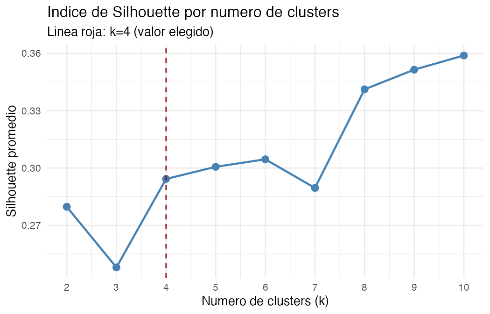
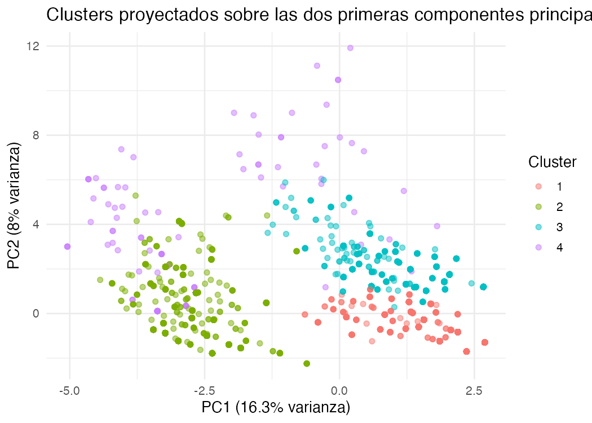
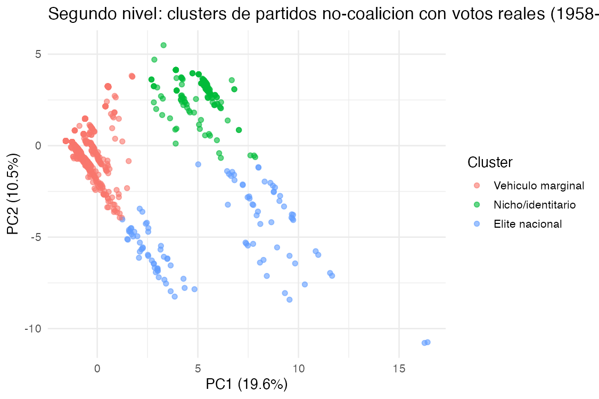

# Más allá de la ideología

### Tipologías empíricas de los partidos y movimientos políticos colombianos (1848–2023)

Aprendizaje de Máquinas y Políticas Públicas

Bogotá Summer School in Economics 2026 — Pontificia Universidad Javeriana

Reporte de política · 6 de julio de 2026

**Autor: Andrez Felipe Guerrero Torres**

Datos: Cabra-Ruíz, Torres, Wills-Otero & Castilla-Gutiérrez (2023); Torres, Barinas-Forero, Forero-Mesa, Sánchez & Tibavisco (2023). Centro de Estudios sobre Desarrollo Económico (CEDE), Universidad de los Andes.

Repositorio: https://github.com/andrezconz/curso-machine-learning-2026-tf

---

## 1. Pregunta de investigación

¿Qué patrones de partidos y movimientos políticos colombianos pueden identificarse mediante aprendizaje no supervisado para el período 1848–2023?

## 2. Motivación

La forma habitual de describir a un partido es por su etiqueta ideológica, pero de acuerdo con Cabra-Ruíz et al. (2023) en Colombia cerca del 40% de los partidos no tiene ideología clasificable, y esa ausencia no se concentra en los partidos marginales: la identidad ideológica bien definida resulta casi exclusiva de los partidos de alcance estrictamente local; tanto los partidos marginales como la élite institucionalizada y multinivel —polos opuestos en éxito electoral— carecen de ella en proporciones igual de altas. Un marco que se apoye en la ideología está, entonces, construido sobre una justificación que no representa la distribución del sistema partidista.

### 2.1 Justificación Conceptual

Por su parte, la literatura sobre sistemas de partidos ofrece dimensiones más robustas y observables. Panebianco (1988) y Mainwaring y Scully (1995) definen la institucionalización partidista como la capacidad de sobrevivir y reproducirse en el tiempo más allá de sus fundadores, aproximable con la longevidad organizativa. Jones y Mainwaring (2003) proponen la nacionalización electoral —competencia sostenida en múltiples niveles— como complemento natural. Meguid (2005) caracteriza a los partidos de nicho como aquellos que compiten sobre una dimensión estrecha y no económica (étnica, religiosa, sectorial). Estas tres nociones —institucionalización, nacionalización y nicho— se usan aquí para nombrar e interpretar los perfiles encontrados. Esta elección no es solo una lectura externa: los propios autores de la base (Cabra-Ruíz et al., 2023) clasifican a los partidos colombianos en cinco dimensiones —ideología, grupos identitarios, tradicionalidad, nacionalización y longevidad—, es decir, la longevidad ya es, por diseño, una de las dimensiones centrales de esta base.

Esta relectura no es solo académica: Pizarro Leongómez (2006) ya describía al sistema de partidos colombiano como un “gigante con pies de barro” —aparentemente sólido en votos, pero organizativamente frágil— y el debate sobre la proliferación de partidos —“partidos de garaje” o “microempresas electorales”— ha sido central en las reformas al régimen de partidos (Acto Legislativo 01 de 2003, Ley 1475 de 2011, y las discusiones de 2023–2025). La preocupación de fondo es que muchas organizaciones obtienen o mantienen personería jurídica sin construir una organización duradera, lo que fragmenta la representación y encarece la administración electoral. Si la ideología no distingue bien a estos partidos, la institucionalización y la nacionalización sí podrían hacerlo, de forma más directamente accionable para el diseño de reglas.

Este reporte busca identificar, sobre el universo completo de partidos y movimientos políticos registrados en Colombia, los patrones organizativos y electorales que emergen del análisis de aprendizaje no supervisado, evaluando en qué medida estos corresponden con las dimensiones de institucionalización y nacionalización propuestas en la literatura especializada.

## 3. Estrategia empírica

Dado que la pregunta es descriptiva y no existe una variable de “tipo de partido” previamente etiquetada, se descartó cualquier método supervisado (regresión logística, árboles, kNN, SVM): la tipología es precisamente lo que se busca descubrir. Se optó por K-Means por tres razones:

- Escala: con 5.143 observaciones, el clustering jerárquico (matriz de distancias n×n) es poco práctico frente a K-Means, cuyo costo crece linealmente con n.
- Naturaleza de los datos: tras codificar dummies y estandarizar, K-Means con distancia euclidiana es simple, interpretable y eficiente para una primera aproximación exploratoria.
- Validez interna verificable: a diferencia de DBSCAN (sensible a la densidad, poco adecuado para datos dummy dispersos) o mezclas gaussianas (asumen covarianza continua poco natural para binarias), K-Means admite criterios estándar (codo, silhouette, Calinski-Harabasz) para justificar objetivamente k.

El PCA se usa únicamente como herramienta de visualización e interpretación de cargas, no como reducción de dimensionalidad previa al clustering (K-Means corrió sobre las variables dummy estandarizadas). Los grupos se validaron con pruebas χ² de independencia frente a cada variable original, con la V de Cramér como tamaño de efecto y corrección de Benjamini-Hochberg para el múltiple testing (12 pruebas). Con el objetivo de emplear diversos modelos, se desarrolla un árbol de decisión y un Random Forest, para una vez establecido el cluster, predecirlo a partir de las variables originales permitiendo rankear su importancia de forma conjunta, no variable por variable como hace la V de Cramér.

Conviene distinguir dos pasos que demarcan la estrategia empírica de este reporte: K-Means agrupa partidos únicamente a partir de patrones observados en los datos (participación electoral por nivel, tradicionalidad, grupo representativo); los nombres asignados a cada cluster (“institucionalizado”, “no institucionalizado”, “de nicho”) son una interpretación teórica posterior, apoyada en la literatura mencionada, no una medición directa del algoritmo. El modelo no mide institucionalización: descubre un patrón de alcance multinivel que esa literatura permite nombrar así.

La longevidad no se incorporó al algoritmo de clustering para preservar su independencia analítica. Posteriormente se empleó como variable de validación externa, evaluando si los perfiles identificados correspondían con distintos niveles de institucionalización organizativa descritos por la literatura.

## 4. Datos

El estudio utiliza dos fuentes de información complementarias del Centro de Estudios sobre Desarrollo Económico (CEDE) de la Universidad de los Andes. La primera corresponde a la base de datos de Cabra-Ruíz, Torres, Wills-Otero y Castilla-Gutiérrez (2023), que registra la totalidad de partidos, movimientos y coaliciones con participación electoral en Colombia entre 1958 y 2022. La unidad de observación es el partido, movimiento o coalición política, aunque la variable temporalidad permite rastrear organizaciones fundadas desde 1848, como los partidos Liberal y Conservador. La base contiene 5.143 observaciones y 27 variables, de las cuales 25 corresponden al diccionario oficial y dos registran la participación en primera y segunda vuelta presidencial. Las variables utilizadas en el análisis se presentan en la Tabla A1 (Anexos).

Como fuente complementaria se empleó la base de resultados electorales históricos de Colombia (1958–2023) elaborada por Torres, Barinas-Forero, Forero-Mesa, Sánchez y Tibavisco (2023), que registra los votos obtenidos por cada candidato en cada municipio y tipo de elección. A diferencia de la primera base, que únicamente identifica la participación de un partido en un determinado nivel electoral mediante variables binarias, esta segunda incorpora la magnitud del respaldo electoral expresada en votos efectivos. Su propósito en este estudio no es construir la tipología inicial, sino proporcionar una fuente independiente para evaluar la consistencia de los perfiles identificados mediante aprendizaje no supervisado.

### 4.1 Calidad y tratamiento de los datos

Las dos bases se integraron mediante el nombre de los partidos utilizando un procedimiento de normalización de texto que incluyó conversión a mayúsculas, eliminación de tildes, signos de puntuación y términos genéricos como PARTIDO y MOVIMIENTO. El proceso permitió emparejar el 80,6% de los partidos no coaligados con información electoral disponible. Debido a que los votos obtenidos por una coalición no pueden atribuirse objetivamente a cada uno de los partidos que la integran, las observaciones correspondientes a coaliciones fueron excluidas de la validación con resultados electorales, restringiendo este análisis al universo de 2.155 partidos no coaligados.

*(Ver Tabla A1 en Anexos: variables utilizadas en el modelo.)*

Las variables de texto libre (justificaciones, referencias documentales y fuentes) presentan una elevada proporción de valores faltantes genuinos (73%–100%), situación esperable debido a que solo se diligencian cuando existe documentación primaria disponible. Estas variables no se utilizaron en el análisis.

En las variables categóricas se identificaron códigos centinela que requerían un tratamiento diferenciado. La variable gradonac utiliza el valor 99 para indicar que el grado de nacionalización no puede clasificarse, mientras que las variables grupo_representativo_1 y grupo_representativo_2 distinguen entre dos situaciones distintas: el código 98 corresponde a una respuesta válida ("no representa un grupo identitario") y el código 99 indica ausencia de información. Para evitar este sesgo, los códigos 98 y 99 se conservaron como categorías independientes.

Las variables categóricas se transformaron en variables binarias (dummy) para ser utilizadas por el algoritmo. Se corrigió un problema de codificación que hacía que una variable tuviera más peso que las demás, se eliminaron las variables que no aportaban información y, finalmente, todas las variables se estandarizaron para que contribuyeran por igual al proceso de agrupamiento.

En el caso de la base de resultados electorales, los votos fueron agregados por partido y nivel de elección. Dado el marcado sesgo positivo de su distribución, evidenciado por la amplia diferencia entre la media y la mediana, las variables fueron transformadas mediante la función  antes de su estandarización, reduciendo la influencia de valores extremos y facilitando su incorporación al análisis de agrupamiento.

La distribución de las variables categóricas y la participación electoral por nivel de gobierno se presentan en las Tablas A2 y A3 (Anexos). Antes del análisis de clustering ya se observa un patrón relevante: la participación disminuye progresivamente a medida que aumenta el nivel de la elección, pasando de 55,3% en alcaldías a 1,2% en presidencia, lo que constituye un primer indicio de que la mayoría de las organizaciones políticas colombianas compite exclusivamente en escenarios locales.

*(Ver Tabla A2 en Anexos: distribución de variables categóricas (n = 5.143) y Tabla A3 en Anexos: participación electoral por nivel (n = 5.143)).*

## 5. Implementación de la metodología

### 5.1 Selección del número de clusters

Se calcularon tres criterios para k entre 2 y 10 (100 inicializaciones por valor de k; ver Tabla A4 en Anexos). El Calinski-Harabasz favorece fuertemente k=2 (914), mientras el silhouette crece de forma casi monótona hacia valores mayores de k (máximo en k=10, con 0,364). Ante este desacuerdo entre criterios —habitual en datos dummy de alta dimensionalidad— se optó por k=4: silhouette comparable al de k=2–3 (0,282 vs. 0,280–0,289) y, sobre todo, una partición sustantivamente interpretable, frente a soluciones de k más alto que maximizan la cohesión estadística pero son más difíciles de comunicar con claridad.

*(Ver Tabla A4 en Anexos: selección de k — codo, silhouette y Calinski-Harabasz (nivel 1).)*

*Figura 1. Índice de silhouette por número de clusters (línea punteada: k=4, valor elegido).*

### 5.2 Modelo final y validación

El modelo final (k=4, nstart=100, iter.max=1000, semilla=20260706) explica el 25,2% de la varianza total (between_SS/total_SS) y alcanza un silhouette promedio de 0,26. La cohesión varía entre grupos (Tabla A5, Anexos): los clusters 2 y 3 (los más grandes) muestran silhouette de 0,21 y 0,42 —buena separación—, mientras los clusters 4 y 1 muestran 0,12 y –0,04; el cluster 1, el más pequeño y sustantivamente más interesante, tiene menor cohesión y debe interpretarse con cautela (ver limitaciones).

*(Ver Tabla A5 en Anexos: tamaño y silhouette por cluster (nivel 1).)*

*Figura 2. Clusters proyectados sobre las dos primeras componentes principales del PCA (uso ilustrativo; el clustering se estimó sobre las variables originales).*

### 5.3 Validación estadística de los perfiles

Para cada una de las 12 variables originales se realizó una prueba χ² frente a la asignación de cluster, con V de Cramér y ajuste Benjamini-Hochberg (Tabla A6, Anexos). Las 12 variables resultaron significativas (p < 0,001), confirmando que la partición captura patrones reales, no ruido; encabezan part_presidencia (V=0,821), ideologia (0,615) y grupo_representativo_2 (0,573). Tras corregir el error de codificación dummy (sección 7), tradicional —que con el error mostraba V=1,0, sugiriendo que definía un cluster por sí sola— pasó a 0,305, su peso real entre las 12 variables; la señal original estaba inflada por el artefacto de codificación.

*(Ver Tabla A6 en Anexos: validación estadística de los perfiles (χ² y V de Cramér).)*

La V de Cramér evalúa cada variable de forma aislada frente al cluster, sin controlar por su correlación con las demás; dos variables redundantes entre sí pueden aparecer ambas como "fuertes" aunque aporten la misma señal, y el criterio no escala bien si el número de variables candidatas crece. Como complemento se entrenaron un árbol de decisión único y un Random Forest (500 árboles) para predecir el cluster a partir de las 12 variables originales en conjunto (75%/25% train/test, semilla=20260706). Ambos recuperan el cluster con exactitud muy alta (99,1% y 99,6%) —esperable, dado que K-Means ya agrupó a los partidos usando esas mismas variables—, con el cluster 1 —el más pequeño y menos cohesionado (sección 5.2)— como el más difícil de recuperar (recall 47,8% y 82,6%), coherente con su silhouette negativo.

El ranking de importancia multivariada (MeanDecreaseGini) coincide en general con la V de Cramér —correlación de rangos de Spearman de 0,79 con Random Forest y 0,62 con el árbol único (Tabla A7, Anexos)— pero difiere de forma reveladora en part_presidencia: la variable con mayor V de Cramér (0,821, aislada) cae al quinto lugar en Random Forest. La razón es que part_presidencia identifica casi por sí sola al cluster 1, pero ese mismo cluster ya queda bien delimitado por ideologia, grupo_representativo y gradonac; una vez esas variables están en el modelo, la información adicional que aporta part_presidencia es marginal. Es precisamente el tipo de redundancia que una prueba univariada, variable por variable, no puede detectar, y que un modelo multivariado sí revela de forma directa.

*(Ver Tabla A7 en Anexos: ranking de variables: V de Cramér vs. importancia multivariada (árbol y Random Forest).)*

### 5.4 Segundo nivel: validación con votos electorales reales (1958–2023)

Los indicadores part_* son binarios, sin capturar la magnitud del respaldo electoral. Se incorporaron los resultados electorales históricos (Torres et al., 2023) para los mismos siete niveles, a nivel de candidato-municipio-elección. Al cruzarlos con la base de partidos se confirmó que el 58% de las 5.143 organizaciones (2.988 filas) son coaliciones, en su mayoría de alcance local —aunque el 71% está clasificado como gradonac=1 (“nacional”), y muchas son alianzas puntuales Liberal-Conservador, no coaliciones entre movimientos marginales—.

Dado que no es posible atribuir de forma no arbitraria los votos de una coalición a un partido individual, esas filas se excluyeron, dejando un universo de 2.155 partidos no-coalición.

*(Ver Tabla A8 en Anexos: estadística descriptiva de los votos históricos por nivel (1958–2023).)*

Para cada uno de los 2.155 partidos no-coalición se sumaron los votos por nivel (log-transformados) y se combinaron, con la misma codificación dummy, con las variables categóricas originales. La selección de k favoreció valores bajos (silhouette = 0,542 en k=2 y 0,528 en k=3); se eligió k=3 en vez de k=2 porque separa un tercer grupo —una élite partidista minoritaria— que k=2 fusiona con el grupo intermedio, la distinción más relevante para el reporte de política. Las siete variables de votos (no solo senado) entraron todas al K-Means junto con las categóricas; el tamaño, composición y perfil de votos por cluster están en las Tablas A8 y A9 (Anexos).

*(Ver Tabla A9 en Anexos: clusters del segundo nivel: tamaño y composición ideológica.)*

*(Ver Tabla A10 en Anexos: votos históricos promedio por partido y nivel electoral, por cluster.)*

El patrón se sostiene en los siete niveles: “Partido institucionalizado” supera a “Partido no institucionalizado” por un factor de 60 a 1.300 veces, sin depender de una sola elección. “Partido de nicho” se distingue por presencia relativamente alta en gobernación/presidencia frente a votación mínima en senado, coherente con partidos de representación de intereses específicos que rara vez compiten a nivel nacional.

*Figura 4. Segundo nivel: clusters de partidos no-coalición con votos electorales reales, proyectados sobre PCA.*

“Partido institucionalizado” (4,8% de los no-coalición) incluye, de forma reconocible, al Liberal (43,6 millones de votos históricos al Senado), Conservador (30,5 millones), Cambio Radical, Polo Democrático, Alianza Verde, Nuevo Liberalismo y Opción Ciudadana. Este resultado, con magnitud real de respaldo electoral y restringido a partidos genuinos, corrobora con otra fuente de datos el hallazgo central de la sección 6.

### 5.5 Longevidad organizativa: la institucionalización puesta a prueba

Si la institucionalización es la capacidad de sobrevivir en el tiempo más allá de la fundación (Panebianco, 1988; Mainwaring & Scully, 1995), la longevidad de cada partido (años entre fundación y último registro, campo temporalidad) ofrece una prueba directa —independiente del clustering— de si los nombres del segundo nivel son adecuados (Tabla A11, Anexos). El contraste es contundente: la mitad de los partidos no institucionalizados y de nicho desaparecen en el mismo año en que se registran (mediana = 0), mientras los institucionalizados sobreviven en promedio 13,3 años —Liberal y Conservador, fundados en 1848 y 1849 y vigentes en 2022, marcan el máximo de 174 años—. Esta brecha, obtenida con una variable que no participó en el clustering, confirma que institucionalización, más que ideología, es el eje que mejor distingue a los partidos colombianos.

*(Ver Tabla A11 en Anexos: longevidad organizativa por cluster (segundo nivel).)*

## 6. Reporte de resultados

### 6.1 Qué se encontró

Los datos son contundentes: el sistema de partidos colombiano no es un espectro continuo de ideologías, sino una pirámide radicalmente desigual de alcance electoral, y la ideología explica poco de esa desigualdad. El modelo identifica cuatro patrones, con implicaciones distintas para la regulación del sistema de partidos:

- Cluster 1 — “Partidos institucionalizados y nacionalizados” (1.8%, n=93): el más pequeño y determinante. Participa en todos los niveles muy por encima del promedio (67.7% presidencia, 50.5% senado, 55.9% cámara), pero el 66.7% no tiene ideología clasificable — el éxito multinivel se asocia con menor perfil programático, consistente con un sistema más personalista/clientelar que doctrinario.
- Cluster 2 — “Partidos no institucionalizados” (39.4%, n=2.024): el más grande. 99.6% sin ideología clasificable, casi nada tradicional (0.4%), participación dispersa sin patrón de consolidación.
- Cluster 3 — “Partidos ideológicos locales” (37.6%, n=1.931): ~100% con ideología clasificada (77.6% “ni derecha ni izquierda”), concentrado en alcaldías (73.6%), presencia nula en presidencia.
- Cluster 4 — “Partidos ideológicos de espectro amplio” (21.3%, n=1.095): totalmente clasificados (30.0% izquierda, 65.8% “ni derecha ni izquierda”), alcance local moderado.

El hallazgo central es cuantitativo: solo 93 partidos (1.8%) están institucionalizados y nacionalizados; el 98.2% restante opera en un solo nivel o de forma marginal. El segundo nivel (votos reales, sin coaliciones) corrobora el patrón: solo el 4,8% de los partidos genuinos —“Partido institucionalizado”, que incluye al Liberal, Conservador, Cambio Radical, Polo y Verde— concentra el grueso del respaldo electoral, mientras el 86% no está institucionalizado y tiene votación marginal.

### 6.2 Qué significa para la política pública

Los resultados muestran que el desempeño electoral obtenido en una única elección constituye una medida insuficiente para evaluar la continuidad y consolidación de un partido político. Mientras un número considerable de organizaciones logra alcanzar un umbral electoral en una elección específica, solo una minoría mantiene una presencia sostenida en múltiples niveles de competencia y a lo largo del tiempo. En este estudio, únicamente 93 organizaciones (1,8%) presentan un patrón consistente con partidos institucionalizados y nacionalizados.

De este hallazgo se derivan varias implicaciones para el diseño del régimen de partidos:

- Los requisitos para conservar la personería jurídica podrían considerar no solo el desempeño en una elección determinada, sino también la capacidad de competir de manera sostenida en distintos niveles electorales, dado que la mayoría de las organizaciones históricas no presenta ese patrón de continuidad.
- La financiación estatal podría incorporar indicadores de presencia electoral multinivel además del volumen de votos, incentivando la consolidación organizativa y desincentivando la creación de partidos de corta duración.
- La escasa asociación entre institucionalización e identidad ideológica sugiere que el fortalecimiento de partidos programáticos requiere instrumentos específicos, más allá de asumir que el éxito electoral conduce, por sí mismo, a una mayor estructuración ideológica.
- La tipología propuesta puede utilizarse como herramienta de seguimiento del sistema de partidos. Su aplicación periódica permitiría a la Registraduría Nacional y al Consejo Nacional Electoral evaluar si las reformas al régimen de partidos favorecen la consolidación de organizaciones estables o, por el contrario, incentivan la proliferación de partidos no institucionalizados.

Finalmente, la tipología debe entenderse como un instrumento analítico para apoyar el diseño y la evaluación de políticas públicas, y no como un criterio automático para el reconocimiento o la cancelación de la personería jurídica de los partidos políticos en Colombia.

### 6.3 Escalabilidad de los resultados: ¿funcionaron las reformas?

Usando el año de fundación, se comparó la composición de los clusters del segundo nivel entre partidos no-coalición fundados en cuatro periodos delimitados por hitos de reforma: antes de 1991, 1991–2003, 2003–2011 (Acto Legislativo 01/2003, umbral electoral) y 2011–2023 (Ley 1475/2011, requisitos de personería) (Tabla A12, Anexos). El patrón es contrario al objetivo declarado: el número de partidos nuevos se disparó tras cada reforma (de 395 en 2003–2011 a 1.097 en 2011–2023, un periodo más corto), mientras la probabilidad de que un partido nuevo llegue a “institucionalizado” cayó de 14,4% a 1,2%. Ni el umbral de 2003 ni la Ley 1475 frenaron la creación de partidos no institucionalizados; si acaso, coincidieron con una aceleración de su proliferación, mientras alcanzar peso real se volvió más difícil frente a la ventaja consolidada de organizaciones históricas (Liberal, Conservador). Esto refuerza la recomendación de exigir desempeño multinivel sostenido, no un umbral de votación puntual.

*(Ver Tabla A12 en Anexos: composición de clusters (segundo nivel) por periodo de fundación.)*

## 7. Limitaciones

### 7.1 Errores metodológicos identificados y corregidos

- Codificación dummy asimétrica: model.matrix(~.-1, ...) asignaba, por un comportamiento conocido de R, codificación de rango completo a la primera variable (tradicional) y codificación de referencia a las demás, duplicando su peso en la distancia euclídea. Se corrigió generando la matriz con intercepto y eliminándolo después.
- Imputación por moda de códigos centinela: los códigos 98/99 (hasta 98.6% de casos en algunas variables) se recodificaban a NA sin distinguirlos y se imputaban con la moda, fabricando variables casi constantes. Se corrigió tratándolos como categorías legítimas y diferenciadas.

Ambas correcciones cambiaron los resultados de forma material (la V de Cramér de tradicional pasó de 1,0 a 0,305), lo que subraya la importancia de auditar el preprocesamiento en clustering sobre variables dummy.

### 7.2 Limitaciones

- Alcance descriptivo: el estudio identifica patrones de agrupamiento, pero no permite establecer relaciones causales. Las asociaciones observadas deben interpretarse como correlaciones y no como efectos causales.
- Estabilidad de los clusters: el grupo de partidos institucionalizados y nacionalizados (n = 93) mostró cierta sensibilidad a la inicialización del algoritmo y al método de agrupamiento. En consecuencia, los resultados deben interpretarse como perfiles empíricos aproximados y no como fronteras exactas entre tipos de partidos.
- Validación del modelo: el árbol de decisión y el Random Forest utilizan las mismas variables con las que se construyeron los clusters, por lo que su utilidad radica en identificar la importancia relativa de las variables y no en validar de manera independiente la clasificación. La validación externa se realizó mediante los resultados electorales históricos y la longevidad organizativa.
- Cobertura y calidad de los datos: alrededor del 40% de los partidos no cuenta con una clasificación ideológica y el emparejamiento con la base de resultados electorales alcanzó el 80,6% de los partidos no coaligados. Además, las coaliciones se excluyeron de la validación por no ser posible atribuir objetivamente sus votos a cada partido integrante.
- Dimensión temporal: el análisis agrupa organizaciones registradas entre 1848 y 2023 sin modelar explícitamente los cambios en las reglas institucionales ocurridos durante ese periodo. Por tanto, parte de los patrones identificados puede reflejar diferencias históricas más que tipos permanentes de organización partidista.

## Referencias

Cabra-Ruíz, N., Torres, S., Wills-Otero, L., & Castilla-Gutiérrez, V. (2023). Una caracterización histórica de los partidos políticos de Colombia: 1958–2022 (Documento CEDE-Datos). Centro de Estudios sobre Desarrollo Económico, Universidad de los Andes.

Jones, M. P., & Mainwaring, S. (2003). The nationalization of parties and party systems: An empirical measure and an application to the Americas. Party Politics, 9(2), 139–166.

Mainwaring, S., & Scully, T. R. (Eds.). (1995). Building Democratic Institutions: Party Systems in Latin America. Stanford University Press.

Meguid, B. M. (2005). Competition between unequals: The role of mainstream party strategy in niche party success. American Political Science Review, 99(3), 347–359.

Panebianco, A. (1988). Political Parties: Organization and Power. Cambridge University Press.

Pizarro Leongómez, E. (2006). Giants with feet of clay: political parties in Colombia. En Party Politics in the Andes. Rowman & Littlefield.

Torres, S., Barinas-Forero, A., Forero-Mesa, W., Sánchez, J. E., & Tibavisco, M. (2023). Resultados electorales de Colombia (Documento CEDE-Datos). Centro de Estudios sobre Desarrollo Económico, Universidad de los Andes. DataHub Uniandes, DOI: 10.71590/R2KLKI.

## Anexos

Tablas de apoyo referenciadas en el cuerpo del reporte, presentadas aquí para no interrumpir el hilo argumentativo del texto principal.

### Tabla A1. Variables utilizadas en el modelo

| Variable | Descripción | Tipo |
|---|---|---|
| tradicional | Indicador de partido tradicional (Liberal/Conservador y afines) | Dummy |
| gradonac | 0 = No nacional; 1 = Nacional; 99 = No se puede clasificar | Categórica |
| ideologia | 1 = Izquierda; 2 = Derecha; 3 = Ni derecha ni izquierda; 4 = Información insuficiente | Categórica |
| grupo_representativo_1/2 | Grupo identitario representado (afro, indígena, cristiano, ex-militante, campesino, mujer, víctima); 98 = no representa; 99 = sin información | Categórica |
| part_alcaldia ... part_senado | Participación (0/1) en 7 tipos de elección + 1ª/2ª vuelta presidencial | Dummy (9) |

*Fuente: Cabra-Ruíz, Torres, Wills-Otero & Castilla-Gutiérrez (2023).*

### Tabla A2. Distribución de variables categóricas (n=5.143)

| Variable | Categoría | n | % |
|---|---|---|---|
| tradicional | 0 — No tradicional | 4,838 | 94.1% |
| tradicional | 1 — Tradicional | 305 | 5.9% |
| gradonac | 0 — No nacional | 2,428 | 47.2% |
| gradonac | 1 — Nacional | 2,134 | 41.5% |
| gradonac | 99 — No se puede clasificar | 581 | 11.3% |
| ideologia | 1 — Izquierda | 414 | 8.0% |
| ideologia | 2 — Derecha | 414 | 8.0% |
| ideologia | 3 — Ni derecha ni izquierda | 2,237 | 43.5% |
| ideologia | 4 — Información insuficiente | 2,078 | 40.4% |
| grupo_representativo_1 | 1–7 (afro, indígena, cristiano, ex-militante, campesino, mujer, víctima) | 587 | 11.4% |
| grupo_representativo_1 | 98 — No representa grupo identitario | 979 | 19.0% |
| grupo_representativo_1 | 99 — No se tiene información | 3,577 | 69.6% |
| grupo_representativo_2 | 1–6 (mismas categorías, sin víctimas) | 72 | 1.4% |
| grupo_representativo_2 | 98 — No representa grupo identitario | 3,056 | 59.4% |
| grupo_representativo_2 | 99 — No se tiene información | 2,015 | 39.2% |

*Fuente: elaboración propia con datos de Cabra-Ruíz et al. (2023).*

### Tabla A3. Participación electoral por nivel (n=5.143)

| Nivel | n participa | % participa |
|---|---|---|
| Alcaldía | 2,844 | 55.3% |
| Concejo | 1,364 | 26.5% |
| Cámara | 773 | 15.0% |
| Asamblea | 444 | 8.6% |
| Gobernación | 274 | 5.3% |
| Senado | 227 | 4.4% |
| Presidencia | 63 | 1.2% |

*Fuente: elaboración propia con datos de Cabra-Ruíz et al. (2023).*

### Tabla A4. Selección de k — codo, silhouette y Calinski-Harabasz (nivel 1)

| k | WSS | Silhouette | Calinski-Harabasz |
|---|---|---|---|
| 2 | 130,984 | 0.280 | 914 |
| 3 | 123,017 | 0.289 | 653 |
| 4 | 114,504 | 0.282 | 595 |
| 5 | 108,305 | 0.286 | 545 |
| 6 | 103,370 | 0.318 | 506 |
| 7 | 98,155 | 0.308 | 489 |
| 8 | 93,424 | 0.316 | 478 |
| 9 | 87,734 | 0.358 | 487 |
| 10 | 83,409 | 0.364 | 484 |

*Fuente: elaboración propia.*

### Tabla A5. Tamaño y silhouette por cluster (nivel 1)

| Cluster | n | % del total | Silhouette promedio |
|---|---|---|---|
| 1 | 93 | 1.8% | −0.04 |
| 2 | 2,024 | 39.4% | 0.21 |
| 3 | 1,931 | 37.6% | 0.42 |
| 4 | 1,095 | 21.3% | 0.12 |

*Fuente: elaboración propia.*

### Tabla A6. Validación estadística de los perfiles (χ² y V de Cramér)

| Variable | V de Cramér | χ² | p ajustado (BH) |
|---|---|---|---|
| part_presidencia | 0.821 | 3,463.4 | < 0.001 |
| ideologia | 0.615 | 5,835.6 | < 0.001 |
| grupo_representativo_2 | 0.573 | 5,058.6 | < 0.001 |
| grupo_representativo_1 | 0.571 | 5,038.6 | < 0.001 |
| gradonac | 0.542 | 3,017.0 | < 0.001 |
| part_senado | 0.326 | 547.4 | < 0.001 |
| tradicional | 0.305 | 479.6 | < 0.001 |

*Fuente: elaboración propia.*

### Tabla A7. Ranking de variables: V de Cramér vs. importancia multivariada (árbol y Random Forest)

| Variable | V de Cramér (rango) | Random Forest % (rango) | Árbol único % (rango) |
|---|---|---|---|
| part_presidencia | 0.821 (1) | 2.5% (5) | 1.1% (8) |
| ideologia | 0.615 (2) | 24.3% (3) | 26.8% (1) |
| grupo_representativo_2 | 0.573 (3) | 26.9% (2) | 22.8% (2) |
| grupo_representativo_1 | 0.571 (4) | 32.0% (1) | 20.7% (3) |
| gradonac | 0.542 (5) | 10.2% (4) | 18.4% (4) |
| part_senado | 0.326 (6) | 0.3% (10) | — (11) |
| part_camara | 0.319 (7) | 0.6% (8) | 4.7% (5) |
| part_alcaldia | 0.317 (8) | 1.1% (6) | 3.2% (6) |
| tradicional | 0.305 (9) | 1.0% (7) | — (11) |
| part_asamblea | 0.263 (10) | 0.3% (10) | 1.0% (9) |
| part_concejo | 0.202 (11) | 0.5% (9) | 1.2% (7) |
| part_gobernacion | 0.169 (12) | 0.2% (12) | — (11) |

*Fuente: elaboración propia.*

### Tabla A8. Estadística descriptiva de los votos históricos por nivel (1958–2023)

| Nivel | Partidos con votos | Votos totales | Promedio | Mediana | Máximo |
|---|---|---|---|---|---|
| Concejo | 618 | 141,520,199 | 228,997 | 2,678 | 50,204,571 |
| Asamblea | 141 | 139,802,861 | 991,510 | 59,738 | 61,833,083 |
| Cámara | 460 | 109,568,676 | 238,193 | 4,620 | 47,622,263 |
| Senado | 171 | 102,928,017 | 601,918 | 37,287 | 43,675,547 |
| Alcaldía | 808 | 99,644,219 | 123,322 | 3,249 | 27,318,479 |
| Presidencia | 64 | 93,826,350 | 1,466,037 | 29,177 | 41,705,550 |
| Gobernación | 145 | 59,680,036 | 411,586 | 90,477 | 22,171,005 |

*Fuente: elaboración propia con datos de Torres, Barinas-Forero, Forero-Mesa, Sánchez & Tibavisco (2023).*

### Tabla A9. Clusters del segundo nivel: tamaño y composición ideológica

| Cluster | n | % | Ideología no clasif. | Ejemplos |
|---|---|---|---|---|
| Partido no institucionalizado | 1,854 | 86.0% | 99.8% | microempresas electorales sin trayectoria |
| Partido de nicho | 198 | 9.2% | 0.0% | ONIC, movimientos cristianos, integración popular |
| Partido institucionalizado | 103 | 4.8% | 48.5% | Liberal, Conservador, Cambio Radical, Polo, Verde |

*Fuente: elaboración propia.*

### Tabla A10. Votos históricos promedio por partido y nivel electoral, por cluster

| Cluster | Alcaldía | Asamblea | Cámara | Concejo | Gobernación | Presidencia | Senado |
|---|---|---|---|---|---|---|---|
| Partido no institucionalizado | 6,686 | 1,024 | 2,026 | 2,782 | 3,529 | 1,650 | 1,431 |
| Partido de nicho | 16,399 | 1,905 | 2,370 | 4,126 | 17,845 | 67,019 | 782 |
| Partido institucionalizado | 805,796 | 1,329,062 | 1,020,909 | 1,290,609 | 471,643 | 752,177 | 971,416 |

*Fuente: elaboración propia.*

### Tabla A11. Longevidad organizativa por cluster (segundo nivel)

| Cluster | n | Longevidad promedio (años) | Longevidad mediana (años) | Longevidad máxima (años) |
|---|---|---|---|---|
| Partido no institucionalizado | 1,854 | 0.5 | 0 | 43 |
| Partido de nicho | 198 | 0.8 | 0 | 25 |
| Partido institucionalizado | 103 | 13.3 | 8 | 174 |

*Fuente: elaboración propia con datos de temporalidad (Cabra-Ruíz et al., 2023).*

### Tabla A12. Composición de clusters (segundo nivel) por periodo de fundación

| Período | n partidos nuevos | % Institucionalizado | % Nicho | % No institucionalizado |
|---|---|---|---|---|
| Antes de 1991 | 279 | 10.0% | 2.2% | 87.8% |
| 1991–2003 (Const. 91) | 354 | 14.4% | 5.1% | 80.5% |
| 2003–2011 (Acto Legislativo 01/2003) | 395 | 2.8% | 7.1% | 90.1% |
| 2011–2023 (Ley 1475/2011) | 1,097 | 1.2% | 13.1% | 85.7% |

*Fuente: elaboración propia con datos de Cabra-Ruíz et al. (2023).*
